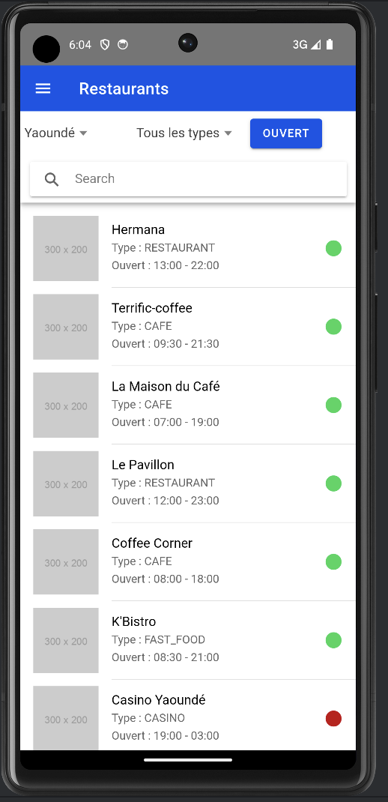
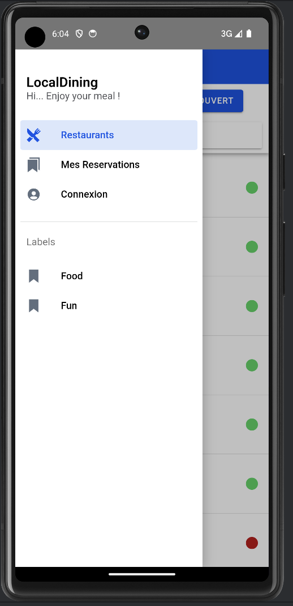
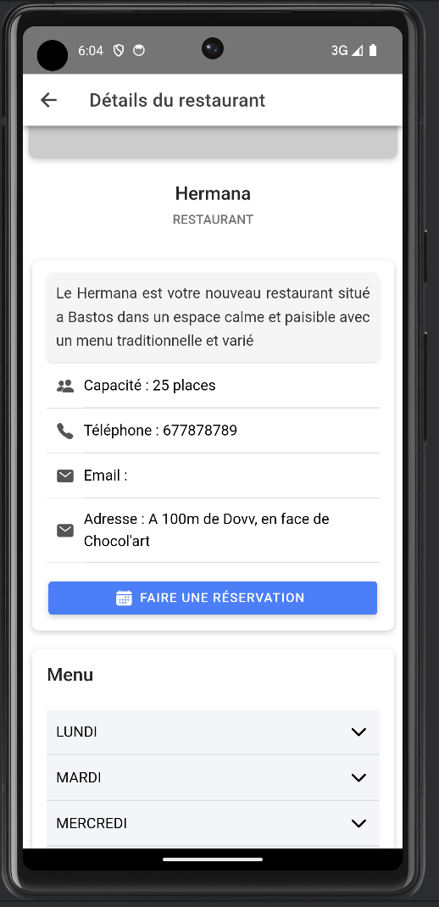
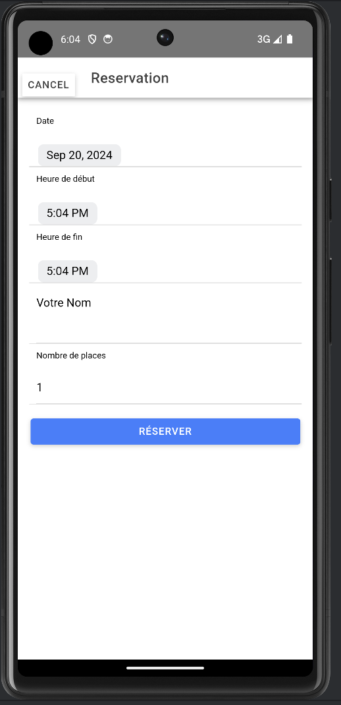
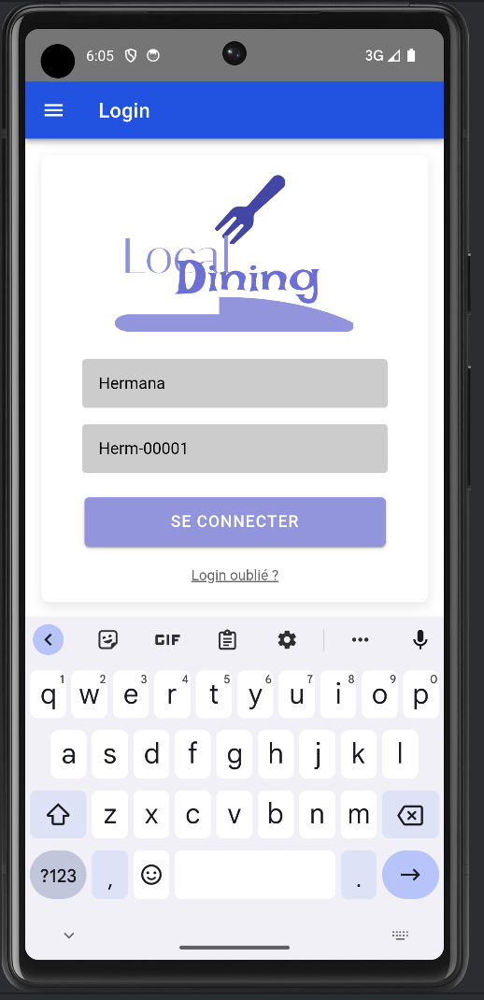
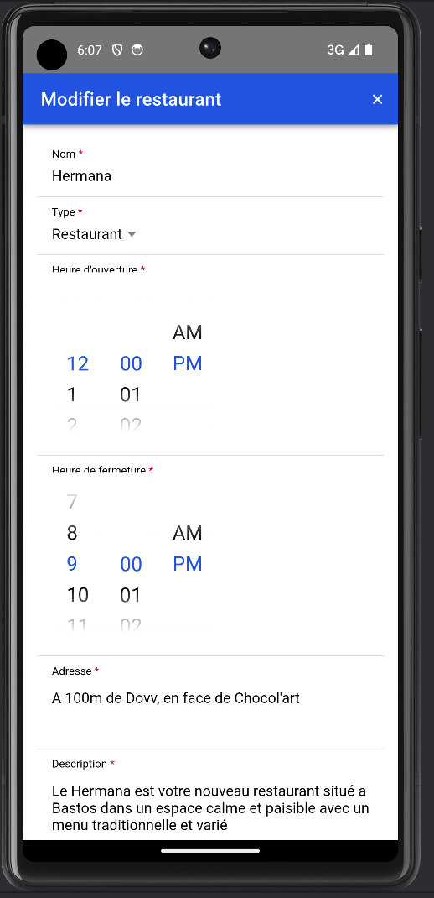
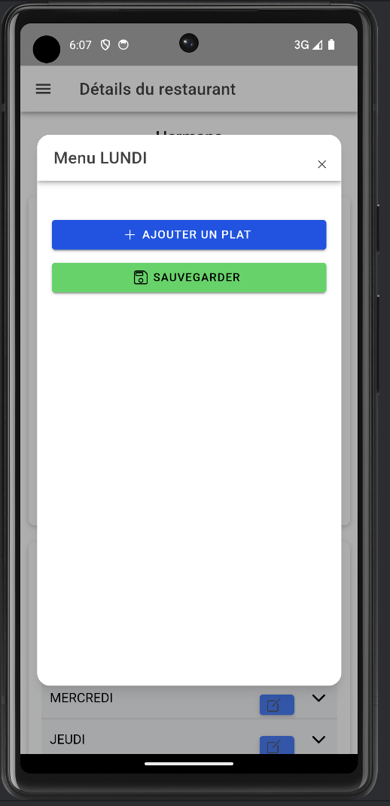
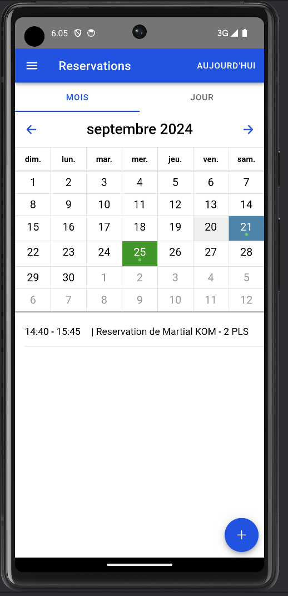
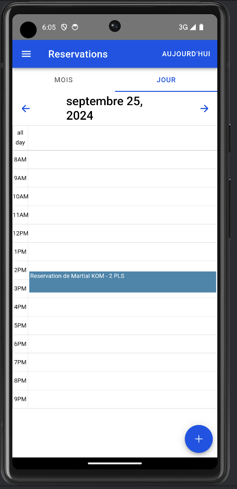

# Application de Réservation de Restaurant en Ligne

## NB: L'apk se trouve dans l'arborescence: LocalDinning-Groupe1.apk

## API DOC: http://207.180.206.20:8001/swagger-ui/index.html

**Groupe 1 :**
- KOM KANMEGNE MARTIAL
- AMADOU ABDOU

Bienvenue dans notre application de réservation de restaurant en ligne, développée avec Ionic. Cette application permet aux utilisateurs de découvrir des restaurants, de faire des réservations, et de gérer leurs événements en toute simplicité.

## Fonctionnalités pour les Internautes

- **Voir tous les restaurants** : Accédez au menu "Restaurants" pour explorer tous les établissements enregistrés sur notre plateforme.
- **Détails des restaurants** : Cliquez sur un restaurant dans la liste pour voir ses informations détaillées.
- **Faire une réservation** : Remplissez un formulaire simple pour réserver une table.
- **Voir vos réservations** : Consultez facilement la liste de toutes vos réservations.
- **Annuler une réservation** : Annulez une réservation en effectuant un swipe vers la gauche sur l'élément correspondant.

## Fonctionnalités pour les Restaurateurs

- **Connexion** : Les restaurateurs peuvent se connecter via le menu "Connexion" en utilisant les identifiants suivants :
  - **Nom d'utilisateur** : Hermana
  - **Mot de passe** : Herm-00001
  - **ou
  - **Nom d'utilisateur** : Terrific-coffee
  - **Mot de passe** : Terr-00002

- **Calendrier des réservations** : Visualisez les réservations sur un calendrier avec des vues mensuelles et journalières.
- **Ajouter un événement** : Ajoutez des événements spéciaux sur le calendrier pour informer vos clients.
- **Mon restaurant** : Accédez aux informations de votre restaurant via le menu "Mon restaurant".
- **Modifier les informations** : Changez facilement les détails de votre restaurant sur la page de détails.
- **Modifier le menu** : Mettez à jour le menu de votre restaurant par jour.

## Images

Quelques images du projet:

